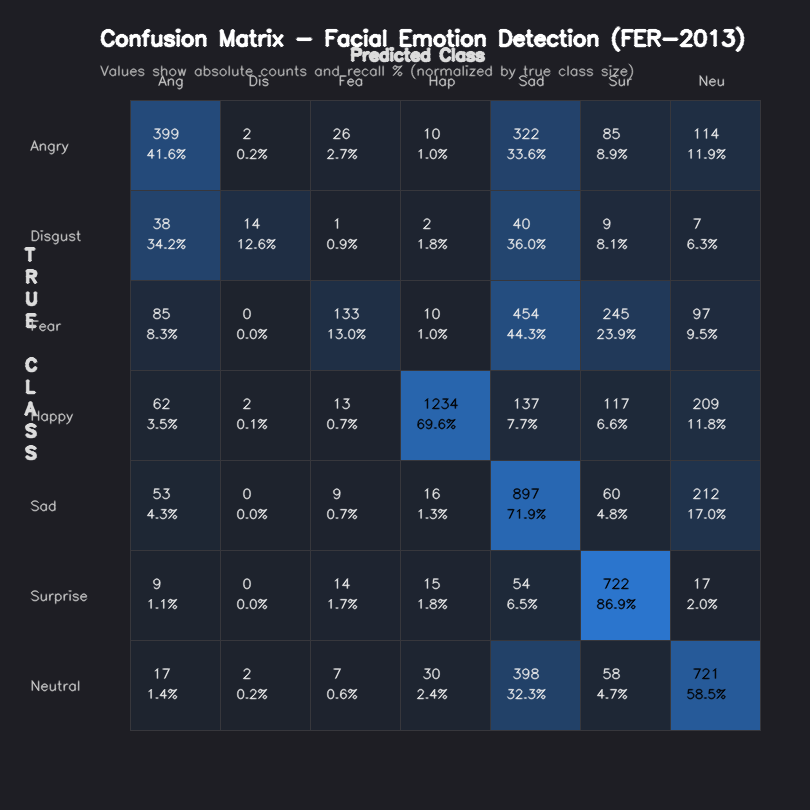

# Real-Time Facial Emotion Detection System

A low-latency, high-accuracy facial emotion detection pipeline consisting of a deep convolutional neural network, a FastAPI backend service, and an OpenCV webcam client.

---

## System Architecture

The pipeline uses a low-latency Edge-Cloud paradigm where a lightweight client application captures real-time video frames, crops faces, and delegates heavy inference workload to a high-capacity FastAPI backend hosting an optimized TFLite model.

```text
+---------------------------------------------------------------------------------------------------+
|                                      SYSTEM PIPELINE FLOW                                         |
+---------------------------------------------------------------------------------------------------+
|                                                                                                   |
|  [ WEBCAM CLIENT ]                                                                                |
|         │                                                                                         |
|         ├─► [Frame Capture] ──► [Haar Cascade Face Detection] ──► [Face Cropping]                  |
|         │                                                                                         |
|         └─► [Base64 Encoding] ───────────────────┐                                                |
|                                                  │                                                |
|  [ FASTAPI SERVER ]                              ▼  HTTP POST /predict (Base64 Image Payload)     |
|         │                                 +──────────────+                                        |
|         │                                 | FastAPI Port |                                        |
|         │                                 |     8001     |                                        |
|         │                                 +──────────────+                                        |
|         │                                        │                                                |
|         ├─► [Base64 Decoding] ──► [Grayscale CLAHE Equalization] ──► [Resizing (48x48x1)]         |
|         │                                                                                         |
|         └─► [TFLite float32 Inference] ──► [Class Mapping (ArgMax)]                                |
|                                                  │                                                |
|  [ INFERENCE HUD OVERLAY ]                       ▼ HTTP Response: {"prediction": "Emotion"}        |
|         │                                 +──────────────+                                        |
|         └─► [Draw Bounding Box] ──────────► [Draw Live Text HUD] ─────────────────────────────────┘|
|                                                                                                   |
+---------------------------------------------------------------------------------------------------+
```

---

## Convolutional Neural Network (CNN) Architecture

The deep neural network is custom-designed with 4 sequential convolutional feature extraction blocks followed by a dense classification layer, optimized specifically for abstract facial feature representations.

```text
+-----------------------------------------------------------------------------------+
|                                 CNN MODEL GRAPH                                   |
+-----------------------------------------------------------------------------------+
|                                                                                   |
|  INPUT: Grayscale Face Crop [48 x 48 x 1]                                         |
|    │                                                                              |
|    ├─► [BLOCK 1] ──► Conv2D (64 filters, 3x3) ──► BatchNorm ──► Conv2D (64)        |
|    │                  ──► BatchNorm ──► MaxPooling (2x2) ──► Dropout (0.15)        |
|    │                                                                              |
|    ├─► [BLOCK 2] ──► Conv2D (128 filters, 3x3) ──► BatchNorm ──► Conv2D (128)      |
|    │                  ──► BatchNorm ──► MaxPooling (2x2) ──► Dropout (0.15)        |
|    │                                                                              |
|    ├─► [BLOCK 3] ──► Conv2D (256 filters, 3x3) ──► BatchNorm ──► Conv2D (256)      |
|    │                  ──► BatchNorm ──► MaxPooling (2x2) ──► Dropout (0.15)        |
|    │                                                                              |
|    ├─► [BLOCK 4] ──► Conv2D (512 filters, 3x3) ──► BatchNorm ──► Conv2D (512)      |
|    │                  ──► BatchNorm ──► MaxPooling (2x2) ──► Dropout (0.15)        |
|    │                                                                              |
|    ├─► [FLATTEN] ──► Flat Vector (2,048 units)                                    |
|    │                                                                              |
|    ├─► [DENSE 1] ──► Fully Connected (512 units) ──► BatchNorm ──► Dropout (0.30)  |
|    │                                                                              |
|    ├─► [DENSE 2] ──► Fully Connected (256 units) ──► BatchNorm ──► Dropout (0.30)  |
|    │                                                                              |
|    └─► [OUTPUT]  ──► Dense Softmax Classifier (7 primary classes)                 |
|                                                                                   |
+-----------------------------------------------------------------------------------+
```

### Key Architectural Enhancements:
1. **Adaptive Contrast Normalization (CLAHE):** Preprocesses faces using Contrast Limited Adaptive Histogram Equalization to mitigate severe shadowing and uneven illumination noise.
2. **Deep Abstract Filters:** A 4-block filter progression (64 → 128 → 256 → 512) to learn multi-scale spatial representations (from edges to complex expression shapes).
3. **Internal Normalization & Regularization:** Leverages `BatchNormalization` for smooth gradient flow, with conservative dropout rates (0.15 in Conv blocks, 0.30 in Dense blocks) to maximize generalization capacity without causing underfitting.

---

## Emotion Classes
The system classifies facial expressions into 7 primary categories:
* Angry
* Disgust
* Fear
* Happy
* Sad
* Surprise
* Neutral

---

## Model Performance & Evaluation

The system was rigorously evaluated over **7,178 independent test images** from the **FER-2013** dataset.

### 📊 Overall Metrics
* **Test Dataset Size:** 7,178 images
* **Overall Accuracy:** **57.40%** (4,120 / 7,178 correct predictions)
* **Average Weighted F1-Score:** **55.86%**

### 📈 Class-wise Metrics (Precision, Recall, F1-Score)

| Emotion | Precision | Recall (Recall/TPR) | F1-Score | Support (Test Set) |
|:---|:---:|:---:|:---:|:---:|
| **Happy** | **93.70%** | 69.56% | **79.84%** | 1,774 |
| **Disgust** | **70.00%** | 12.61% | 21.37% | 111 |
| **Fear** | 65.52% | 12.99% | 21.68% | 1,024 |
| **Surprise** | 55.71% | **86.88%** | 67.89% | 831 |
| **Neutral** | 52.36% | 58.48% | 55.25% | 1,233 |
| **Angry** | 60.18% | 41.65% | 49.23% | 958 |
| **Sad** | 38.97% | 71.93% | 50.55% | 1,247 |

---

### 🗺️ Visual Confusion Matrix

Below is the normalized confusion matrix heatmap generated directly from our test evaluator. The blue intensity represents the recall percentage (True Positive Rate) for each emotion class:



#### Analytical Insights from the Confusion Matrix:
* **Happy & Surprise Dominance:** The model excels at identifying `Happy` (F1-score: **79.84%**) and `Surprise` (F1-score: **67.89%**), which exhibit highly distinct facial musculature patterns (mouth shapes, open eyes).
* **The "Sad-Fear-Neutral" Confusion Cluster:** A significant portion of `Fear` images are misclassified as `Sad` (454 cases) or `Surprise` (245 cases). Similarly, `Sad` images are often confused with `Neutral` (212 cases) and `Angry` (322 cases). This is a well-known phenomenon in facial analysis since low-intensity sadness, neutral expressions, and subtle anger share highly similar visual features in low-resolution 48x48 images.
* **Class Imbalance Impact:** Minority classes such as `Disgust` (only 111 test images) suffer from lower recall (**12.61%**) but maintain high precision (**70.00%**), meaning that when the model predicts disgust, it is highly likely to be correct, but it misses many subtle expressions.

---

## The FER-2013 Dataset

Our model was trained and evaluated on the benchmark **FER-2013** dataset, containing 35,887 grayscale, 48x48 pixel faces. This dataset is widely recognized as highly challenging due to:
1. **Extremely High Noise:** Extreme lighting variance, occlusions (hands/hair in front of faces), cartoon faces, and significant mislabeling.
2. **Severe Class Imbalance:** The distribution is highly skewed, with `Happy` having over 7,200 training images, while `Disgust` has only 436 training images.

### Balanced Loss & Weight Adjustment

FER2013 is heavily imbalanced — *Happy* has ~8,000 samples while *Disgust* has under 500. Without correction, the model learns to ignore minority classes entirely.

To counteract this, the training pipeline dynamically computes inverse-frequency class weights:

$$\text{weight}_c = \frac{N_{\text{total}}}{C \cdot N_c}$$

Where $N_{\text{total}}$ is the total training samples, $C = 7$ is the number of emotion classes, and $N_c$ is the sample count for class $c$. Rarer classes receive proportionally higher weights, penalizing the loss function more heavily for their misclassifications. This directly improves F1-scores on underrepresented emotions like *Disgust* and *Fear* without any data augmentation overhead.

---

## Project Structure
```text
emotion_detection/
├── ml_service/
│   ├── app.py                      # FastAPI server (POST /predict)
│   └── emotion_model.tflite        # Active deployed TFLite model
├── training/
│   ├── train_from_images.py        # Custom 4-block CNN training pipeline
│   ├── evaluate.py                 # Pure-NumPy test set evaluator (7,178 images)
│   ├── generate_cm_image.py        # Script to draw high-quality confusion matrix image
│   ├── confusion_matrix.png        # Generated beautiful visual confusion matrix
│   ├── reconvert.py                # Helper script to export full-precision TFLite
│   └── emotion_model.tflite        # Backup copy of active model
├── webcam_client.py                # OpenCV webcam client with live overlay HUD
├── requirements.txt                # Project dependency manifest
├── startml.sh                      # Helper shell script for ML service startup
├── startwebcam.sh                  # Helper shell script for Webcam client startup
└── README.md                       # Setup and architecture documentation
```

---

## Setup & Running the System

### 1. Install Dependencies
Initialize your virtual environment and install the required libraries:
```bash
# Initialize virtual environment
python -m venv .venv
.venv\Scripts\activate # On Windows

# Install libraries
pip install -r requirements.txt
```

### 2. Running the Server (API)
Start the FastAPI server on port `8001`:
```bash
uvicorn ml_service.app:app --host 0.0.0.0 --port 8001
```
* Interactive API Documentation can be viewed at: `http://localhost:8001/docs`
* Health check: `http://localhost:8001/health`

### 3. Running the Webcam Client
Open a second terminal window (with `.venv` active) and run:
```bash
python webcam_client.py --server http://127.0.0.1:8001/predict
```
* **Webcam Controls:**
  * Press `q` to Quit.
  * Press `s` to Save a snapshot to `snapshot.jpg`.
  * Press `p` to Pause/Resume.

### 4. Running Model Evaluation
To verify model accuracy, precision, and recall metrics over the 7,178 test images:
```bash
python training/evaluate.py
```

---

## API Documentation

### `GET /health`
* **Response:**
```json
{
  "status": "ok",
  "emotions": ["Angry", "Disgust", "Fear", "Happy", "Sad", "Surprise", "Neutral"]
}
```

### `POST /predict`
* **Request Body:**
```json
{
  "image": "<base64-encoded JPEG>"
}
```
* **Response Body:**
```json
{
  "prediction": "Happy",
  "confidence": 0.8177,
  "all_scores": {
    "Angry": 0.051,
    "Disgust": 0.002,
    "Fear": 0.015,
    "Happy": 0.8177,
    "Sad": 0.042,
    "Surprise": 0.012,
    "Neutral": 0.060
  }
}
```
